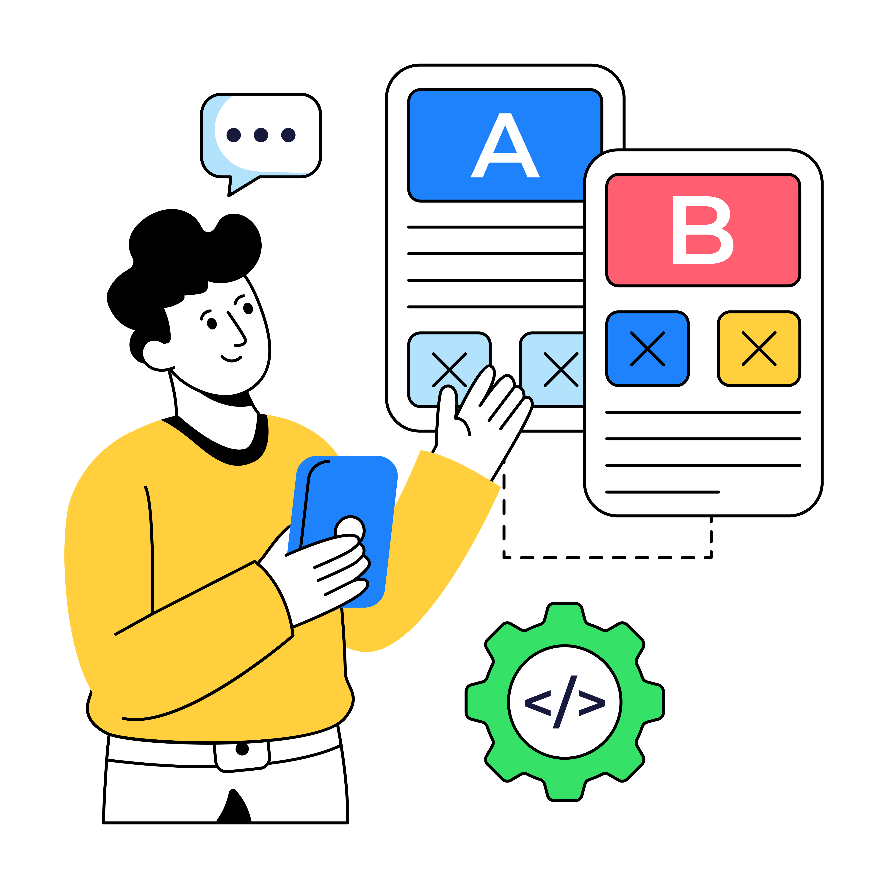

# Journey Optimizer Experimentation Accelerator

>[!AVAILABILITY]
>
>**Journey Optimizer Experimentation Accelerator** kräver en betald licens för kunder och kan integreras smidigt med antingen Adobe Target eller Adobe Journey Optimizer.

**Journey Optimizer Experimentation Accelerator** är ett kraftfullt verktyg som har utformats för att effektivisera och förbättra experimenteringsprocessen. Genom att integrera med Adobe Target och Adobe Journey Optimizer utgör programmet en central plattform för att hantera, analysera och optimera experiment. Med hjälp av AI-baserade insikter och adaptiv testning kan ni med Journey Optimizer Experimentation Accelerator fatta datadrivna beslut, förbättra marknadsföringsstrategier och få mätbara resultat.

Några viktiga fördelar:

* **Snabbare experimenterande**: Kör adaptiva, alltid-på-tester med modeller som justeras över tid.
* **Enhetlig plattform**: Hantera alla experiment från Adobe Target och Journey Optimizer på ett och samma ställe.
* **AI-styrda insikter**: Hitta viktiga resultat, prestandadrivrutiner och nya möjligheter automatiskt.
* **Smartare målgruppsanpassning**: Använd beteendes- och innehållsdata för att prioritera effektiva experiment.
* **KPI-övervakning**: Spåra mätvärden som lyft och förtroende mellan experiment.
* **Smidig Collaboration**: Dela enkelt resultat och hantera teamroller med aviseringar i realtid.

<table style="table-layout:fixed">
<tr style="border: 0; text-align: center;">
<td> <a href="../start/experiment-accelerator-access.md">Kom igång med Journey Optimizer Experimentation Accelerator</a></td>
<td> <a href="../start/experiment-accelerator-best-practices.md">Journey Optimizer Experimentation Accelerator bästa praxis</a></td>
<td> <a href="../track/experiment-accelerator-monitor.md">Spåra och övervaka prestandan för dina experiment</a></td>
</tr>
</table>
