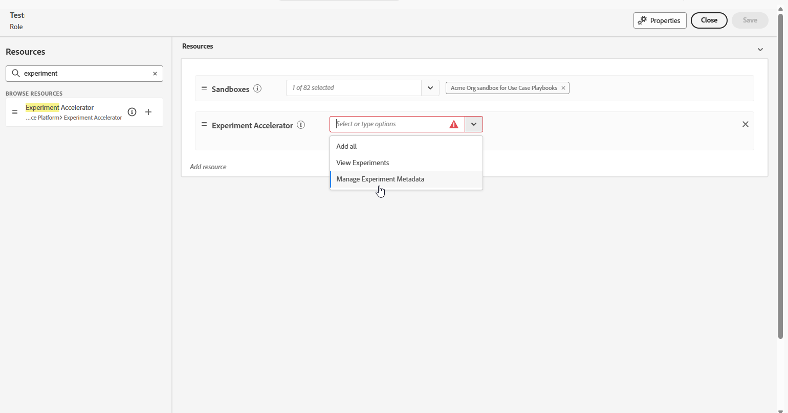

# Använd Journey Optimizer Experimentation Accelerator

När du har [skapat och konfigurerat ditt experiment](https://experienceleague.adobe.com/sv/docs/journey-optimizer/using/content-management/content-experiment/content-experiment) och skickat dina kampanjer eller resor till dina profiler, kan du få tillgång till **[!UICONTROL Journey Optimizer Experimentation Accelerator]** och fördjupa dig i hur ditt experiment fungerar.

Du kan komma åt **[!UICONTROL Journey Optimizer Experimentation Accelerator]** antingen från den vänstra menyn i listrutan [!UICONTROL Experimentation] eller via Apps-väljaren. Observera att användare som bara har en Target-licens bara kan komma åt den via Apps-väljaren.

Vilka experiment som är tillgängliga beror på din konfiguration:

* **För Adobe Journey Optimizer-användare**: Experiment som har konfigurerats i den aktiverade organisationens sandlåda inkluderas automatiskt.

* **För Adobe Target-användare med Journey Optimizer**: Alla A/B-aktiviteter i Target visas i **[!UICONTROL Journey Optimizer Experimentation Accelerator]** i produktionssandlådan för Journey Optimizer.

* **För användare som endast har Adobe Target**: Alla A/B-aktiviteter i målorganisationen inkluderas i produktionssandlådan för Journey Optimizer.

Om du vill använda **[!UICONTROL Journey Optimizer Experimentation Accelerator]** måste du ha tillgång till sandlådan och följande relaterade behörighet:

* **[!UICONTROL View Experiments]**
* **[!UICONTROL Manage Experiment Metada]**

+++ Lär dig hur du tilldelar Experimentrelaterade behörigheter med en Adobe Experience Platform- eller Adobe Journey-optimeringslicens

1. Gå till fliken **[!UICONTROL Roles]** i **[!DNL Permissions]**-produkten och välj önskad **[!UICONTROL Role]**.

1. Klicka på **[!UICONTROL Edit]** om du vill ändra behörigheterna.

1. Lägg till resursen **[!UICONTROL Experiment accelerator]** och välj sedan **[!UICONTROL View Experiments]** och/eller **[!UICONTROL Manage Experiment Metada]** i listrutan.

   

1. Klicka på **[!UICONTROL Save]** om du vill använda ändringarna.

Alla användare som redan har tilldelats den här rollen får sina behörigheter automatiskt uppdaterade.

Så här tilldelar du rollen till nya användare:

1. Navigera till fliken **[!UICONTROL Users]** i rollkontrollpanelen och klicka på **[!UICONTROL Add User]**.

1. Ange användarens namn, e-postadress eller välj i listan och klicka sedan på **[!UICONTROL Save]**.

   Om användaren inte har skapats tidigare, se [den här dokumentationen](https://experienceleague.adobe.com/sv/docs/experience-platform/access-control/abac/permissions-ui/users).

Användaren får ett e-postmeddelande med instruktioner om hur du kommer åt instansen.

+++

 

+++ Lär dig hur du tilldelar Experimentrelaterade behörigheter med Adobe Target-licens

1. Öppna **[Admin Console](http://adminconsole.adobe.com/)**.

1. Välj **[!UICONTROL Adobe Experience Platform]** i **[!UICONTROL Products]**.

1. Klicka på **[!UICONTROL New Profile]**.

   

1. Ange **[!UICONTROL Name]** och **[!UICONTROL Description]** som profil och klicka sedan på **[!UICONTROL Save]**.

1. Öppna din nya **[!UICONTROL Profile]** och gå till fliken **[!UICONTROL Permissions]**.

1. Klicka på  bredvid behörigheten **[!UICONTROL experimentation-accelerator]**.

   

1. Lägg till de behörigheter som den här profilen ska ha, till exempel **[!UICONTROL View Experiments]** och **[!UICONTROL Manage Experiment Metadata]**, och klicka sedan på **[!UICONTROL Save]**.

   >[!TIP]
   >
   > Skapa separata profiler när användarna behöver olika åtkomstnivåer. Skapa till exempel en **[!UICONTROL Experimentation Accelerator Viewer]**-profil med bara **[!UICONTROL View Experiments]** och en **[!UICONTROL Experimentation Accelerator Editor]**-profil med både **[!UICONTROL View Experiments]** och **[!UICONTROL Manage Experiment Metadata]**.

   

1. Välj **[!UICONTROL Sandboxes]** på fliken **[!UICONTROL Permissions]**.

1. Lägg till de sandlådor där användare ska kunna använda Journey Optimizer Experimentation Accelerator och klicka sedan på **[!UICONTROL Save]**.

1. Öppna fliken **[!UICONTROL Users]** och klicka sedan på **[!UICONTROL Add users]**.

   

1. Lägg till de användare som ska få den här åtkomsten och klicka sedan på **[!UICONTROL Save]**.

Användare som läggs till i den här profilen kan nu komma åt Journey Optimizer Experimentation Accelerator från appväljaren.

+++

<!--table style="table-layout:fixed"><tr style="border: 0;">
<td>

<strong><a href="experiment-accelerator-overview.md">Overview</a></strong>

</td>
<td>

<strong><a href="experiment-accelerator-monitor.md">Experiments</a></strong>

</td>
<td>

<strong><a href="experiment-accelerator-metrics.md">Metrics</a></strong>

</td>
</tr></table-->
